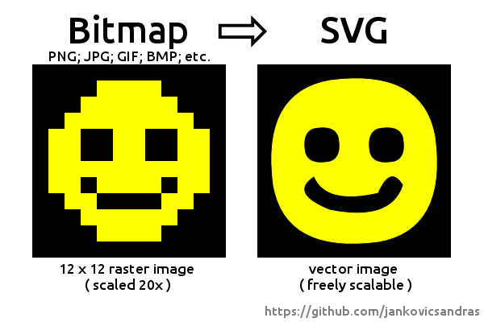
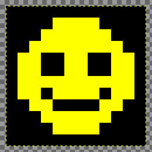
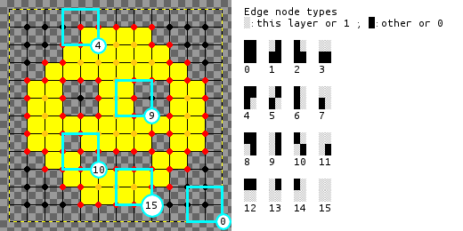
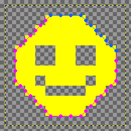
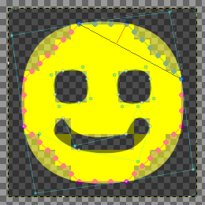

# imagetracerjs


Simple raster image tracer and vectorizer written in JavaScript.

by András Jankovics 2015

### Initialization
Before calling the functions, the library must be included:
```javascript
<script src="imagetracer_v1.0.4.js"></script>
```
Then an ImageTracer object must be created:
```javascript
var it = new ImageTracer();
```
### Examples
#### Example 1
Basic usage: loading image, tracing it and creating SVG string, then executing callback with the SVG string as argument: alert(svgstring). This happens asynchronously, when image is loaded (image.onload event).
```javascript
it.imageToSVG( 'smiley.png', alert );
```
#### Example 2
The same, but appendSVGString() is a simple helper function to display the SVG. Without parameters, it will append the SVG to the end of document.body .
```javascript
it.imageToSVG( 'smiley.png', it.appendSVGString );
```
#### Example 3
The same, but with an options object. This shows the effects of low linear treshold: more round shapes, low quadratic treshold: more polygonal shapes, and scaling.
```javascript
it.imageToSVG( 'smiley.png', it.appendSVGString, { ltres:0.01, qtres:1, scale:10 } );
it.imageToSVG( 'smiley.png', it.appendSVGString, { ltres:1, qtres:0.01, scale:10 } );
```
#### Example 4
The callback here will append the SVG to a container div with the id 'svgcontainer', creating the div if it does not exist yet. This shows also the effects of the 4 color palette.
```javascript
it.imageToSVG(
	'panda.png',
	function(svgstr){ it.appendSVGString( svgstr, 'svgcontainer' ); },
	{ numberofcolors:4 }
);
```
The helper function loadImage() loads an image to a canvas, then executing callback: appending the canvas to a div here.
```javascript
it.loadImage(
	'panda.png',
	function(canvas){ (document.getElementById('canvascontainer')).appendChild(canvas); }
);
```
#### Example 5
Tracing ImageData to an SVG string synchronously. Run Example 4 before this. Getting ImageData from canvas with the helper function getImgdata().
```javascript
var canvas = (document.getElementById('canvascontainer')).firstChild;
var imgd = it.getImgdata( canvas );
```
Tracing to an SVG string with more colors and probably better color quantization.
```javascript
var svgstr = it.imagedataToSVG( imgd, { numberofcolors:16, colorquantcycles:5 } );
```
Appending SVG
```javascript
it.appendSVGString( svgstr, 'svgcontainer' );
```
#### Example 6
This will load an image, trace it when loaded, and execute callback on the tracedata: stringifying and alerting it here.
```javascript
it.imageToTracedata(
	'smiley.png',
	function(tracedata){ alert( JSON.stringify( tracedata ) ); },
	{ ltres:0.01, qtres:1, scale:10 }
);
```
Read imagetracerjs_documentation.html or the source for details on the returned tracedata object.
#### Example 7
imagedataToTracedata() is very similar to the previous functions. This returns tracedata synchronously.
```javascript
it.loadImage(
		'smiley.png',
		function(canvas){ 
			var imgd = it.getImgdata(canvas);
			
			var tracedata = it.imagedataToTracedata( imgd, { ltres:1, qtres:0.01, scale:10 } );
			
			alert( JSON.stringify( tracedata ) );
		}
);
```
### Main Functions
|Function name|Arguments|Returns|Run type|
|-------------|---------|-------|--------|
|imageToSVG|image_url /*string*/ , callback /*function*/ , options /*optional object*/|Nothing, callback(svgstring) will be executed|Asynchronous|
|imagedataToSVG|[ImageData](https://developer.mozilla.org/en-US/docs/Web/API/ImageData) /*object*/ , options /*optional object*/|svgstring /*string*/|Synchronous|
|imageToTracedata|image_url /*string*/ , callback /*function*/ , options /*optional object*/|Nothing, callback(tracedata) will be executed|Asynchronous|
|imagedataToTracedata|[ImageData](https://developer.mozilla.org/en-US/docs/Web/API/ImageData) /*object*/ , options /*optional object*/|tracedata /*object*/|Synchronous|

	
#### Helper Functions
|Function name|Arguments|Returns|Run type|
|-------------|---------|-------|--------|
|appendSVGString|svgstring /*string*/, parentid /*string*/|Nothing, an SVG will be appended to the container div with id=parentid.|Synchronous|
|loadImage|url /*string*/, callback /*function*/|Nothing, loading an image from a URL, then executing callback(canvas)|Asynchronous|
|getImgdata|[canvas](https://developer.mozilla.org/en-US/docs/Web/HTML/Element/canvas) /*object*/|[ImageData](https://developer.mozilla.org/en-US/docs/Web/API/ImageData) /*object*/|Synchronous|

There are more functions for advanced users, read the source if you are interested. :)
	
### Options
|Option name|Default value|Meaning|
|-----------|-------------|-------|
|ltres|1|Error treshold for straight lines. Use 0.001 instead of 0 if only round splines are required.|
|qtres|1|Error treshold for quadratic splines. Use 0.001 instead of 0 if only straight lines are required.|
|pathomit|8|Edge node paths shorter than this will be discarded for noise reduction. Use 1 instead of 0 to get paths around single pixels.|
|pal|No default value|Custom palette, an array of color objects: ```[ {r:0,g:0,b:0,a:255}, ... ]```|
|numberofcolors|16|Number of colors to use on palette if pal object is not defined.|
|mincolorratio|0.02|Color quantization will randomize a color if fewer pixels than (total pixels*mincolorratio) has it.|
|colorquantcycles|3|Color quantization will be repeated this many times.|
|scale|1|Every coordinate will be multiplied with this, to scale the SVG.|
|lcpr|0|Straight line control point radius, if this is greater than zero, small circles will be drawn in the SVG. Do not use this for big/complex images.|
|qcpr|0|Quadratic spline control point radius, if this is greater than zero, small circles and lines will be drawn in the SVG. Do not use this for big/complex images.|
|layercontainerid|No default value|Edge node layers can be visualized if a container div's id is defined.|

The almost complete options object:	
```javascript
var options = { ltres:1, qtres:1, pathomit:8, numberofcolors:16, mincolorratio:0.02, colorquantcycles:3, scale:1, lcpr:0, qcpr:0 };
```
Adding custom palette. This will override numberofcolors.
```javascript
options.pal = [{r:0,g:0,b:0,a:255}, {r:0,g:0,b:255,a:255}, {r:255,g:255,b:0,a:255}];
```
### Process overview
####1. Color quantization
The **colorquantization** function creates an indexed image (https://en.wikipedia.org/wiki/Indexed_color)


####2. Layer separation and edge detection
The **layering** function creates arrays for every color, and calculates edge node types. These are at the center of every 4 pixels, shown here as dots.



####3. Pathscan
The **pathscan** function finds chains of edge nodes, example: the cyan dots and lines.


####4. Interpolation
The **internodes** function interpolates the coordinates of the edge node paths. Every line segment in the new path has one of the 8 directions (East, North East, N, NW, W, SW, S, SE).


####5. Tracing
The **tracepath** function splits the interpolated paths into sequences with two directions.



The **fitseq** function tries to fit a straight line on the start- and endpoint of the sequence (black line). If the distance error between the calculated points (black line) and actual sequence points (blue dots) is greater than the treshold, the point with the greatest error is selected (red line).


The **fitseq** function tries to fit a quadratic spline through the error point.


 


If the **fitseq** function can not fit a straight line or a quadratic spline to the sequence with the given error tresholds, then it will split the sequence in two and recursively call **fitseq** on each part.
####6. SVG rendering
The coordinates are rendered to [SVG Paths](https://developer.mozilla.org/en-US/docs/Web/SVG/Tutorial/Paths) in the **getsvgstring** function.

### Ideas for improvement
- TODO: Node.js support - Canvas and ImageData is not supported by Node.js by default, but [canvas](https://www.npmjs.com/package/canvas) or other packages might solve this.
- Error handling: there's very little error handling now, Out of memory can happen easily with big images or many layers.
- Color quantization: other algorithms?
- Color quantization: colors with few pixels are randomized, but probably the most distant colors should be found instead.
- Tracing: 5.1. finding more suitable sequences.
- Tracing: 5.5. Set splitpoint = (fitting point + errorpoint)/2 ; this is just a guess, there might be a better splitpoint.
- Tracing: 5.7. If splitpoint-endpoint is a spline, try to add new points from the next sequence; this is not implemented.
- Tracing: cubic splines or other curves?
- Default values: they are chosen because they seemed OK, not based on calculations.
- Output: [PDF](https://en.wikipedia.org/wiki/Portable_Document_Format), [DXF](https://en.wikipedia.org/wiki/AutoCAD_DXF),   [G-code](https://en.wikipedia.org/wiki/G-code) or other output?

### License
#### The Unlicense / PUBLIC DOMAIN

This is free and unencumbered software released into the public domain.

Anyone is free to copy, modify, publish, use, compile, sell, or
distribute this software, either in source code form or as a compiled
binary, for any purpose, commercial or non-commercial, and by any
means.

In jurisdictions that recognize copyright laws, the author or authors
of this software dedicate any and all copyright interest in the
software to the public domain. We make this dedication for the benefit
of the public at large and to the detriment of our heirs and
successors. We intend this dedication to be an overt act of
relinquishment in perpetuity of all present and future rights to this
software under copyright law.

THE SOFTWARE IS PROVIDED "AS IS", WITHOUT WARRANTY OF ANY KIND,
EXPRESS OR IMPLIED, INCLUDING BUT NOT LIMITED TO THE WARRANTIES OF
MERCHANTABILITY, FITNESS FOR A PARTICULAR PURPOSE AND NONINFRINGEMENT.
IN NO EVENT SHALL THE AUTHORS BE LIABLE FOR ANY CLAIM, DAMAGES OR
OTHER LIABILITY, WHETHER IN AN ACTION OF CONTRACT, TORT OR OTHERWISE,
ARISING FROM, OUT OF OR IN CONNECTION WITH THE SOFTWARE OR THE USE OR
OTHER DEALINGS IN THE SOFTWARE.

For more information, please refer to [http://unlicense.org](http://unlicense.org)
